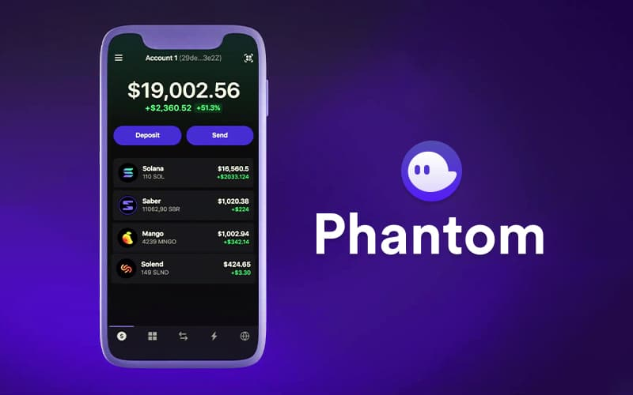

##################
How to Set Up a Phantom Wallet: Step-by-Step Beginner’s Guide
##################

.. meta::
   :msvalidate.01: EC1CC2EBFA11DD5C3D82B1E823DE7278

You can Also Take help from Phantom Wallet Executive using **Phantom Wallet Support +1-870-(406)⇒6577** or **(+1-870-406⇒6577)** Toll Free Number 

Phantom is a popular crypto wallet designed specifically for the Solana blockchain. It’s fast, secure, and easy to use—whether you’re sending SOL, connecting to decentralized apps (dApps), or staking your tokens. In this guide, you’ll learn how to set up your Phantom wallet and perform key actions like connecting to Solana dApps, swapping tokens, and staking SOL for passive rewards.

What Is Phantom Wallet?
-----------------------

Phantom is a non-custodial browser extension and mobile wallet that allows users to interact with the Solana blockchain. It supports SOL, Solana-based tokens (SPL), NFTs, staking, and Web3 apps.

Key Features:

- Secure seed phrase recovery
- Solana dApp integration
- Token swapping and staking
- NFT support
- Mobile and browser compatibility (Chrome, Firefox, iOS, Android)

How to Set Up a Phantom Wallet
------------------------------

Setting up your Phantom wallet takes just a few minutes. Follow these steps:

1. **Install the Phantom Extension or App**  
   - Visit: https://phantom.app/download  
   - Choose your browser (Chrome, Firefox, Edge) or download the mobile app.

2. **Create a New Wallet**  
   - Click “Create New Wallet.”  
   - Save your **12-word recovery phrase** securely. Never share it.  
   - Set a strong password and enable biometric login (for mobile).

3. **Access Your Wallet**  
   Once setup is complete, you’ll see your wallet dashboard with your SOL balance, transaction history, and dApp connection options.

How to Connect Phantom Wallet to Solana dApps
---------------------------------------------

Phantom makes it easy to connect to Web3 applications built on Solana, such as Magic Eden, Raydium, or Jupiter.

Steps to connect:

1. Open your browser and navigate to a supported Solana dApp.
2. Look for a “Connect Wallet” or “Connect Phantom” button.
3. Click it. Your Phantom extension or app will prompt you to approve the connection.
4. Confirm the request. Your wallet is now linked to the dApp.

Tip: Always double-check the dApp URL to ensure it’s the official site and not a phishing attempt.

How to Swap Solana Tokens on Decentralized Apps
-----------------------------------------------

Phantom has a built-in swap feature and also works with dApps like Jupiter Aggregator and Raydium.

**Using Phantom's Built-in Swap:**

1. Open your Phantom wallet.
2. Click the “Swap” tab in the interface.
3. Select the tokens you want to exchange (e.g., SOL to USDC).
4. Enter the amount and review the estimated rate.
5. Click “Swap” and approve the transaction.

**Using dApps for Swapping:**

1. Visit a DEX aggregator like https://jup.ag (Jupiter).
2. Connect your Phantom wallet.
3. Choose tokens, enter the amount, and initiate the swap.
4. Confirm the transaction via Phantom.

How to Stake Solana on Phantom
------------------------------

Staking SOL helps secure the network and earns you passive rewards. Phantom allows you to delegate your SOL to a validator in a few simple steps.

1. Open your Phantom wallet.
2. Click on your SOL balance.
3. Select “Start Earning SOL” or “Stake.”
4. Choose a validator from the list (research their uptime and commission).
5. Enter the amount of SOL you wish to stake.
6. Confirm the transaction.

Once staked, rewards are automatically added to your account over time. You can manage or withdraw your stake anytime.

Final Tips and Security Reminders
---------------------------------

- **Always back up your 12-word recovery phrase** offline.
- **Beware of scams and fake dApps.** Only connect your wallet to trusted platforms.
- **Enable auto-lock** in your Phantom settings for added protection.
- **Use staking calculators** to estimate potential rewards.

Conclusion
----------

Phantom is an essential tool for anyone using the Solana blockchain. With a quick setup, secure access, and smooth dApp connectivity, it’s a powerful wallet for managing SOL, SPL tokens, NFTs, and staking. Follow the steps in this guide to get started and explore everything Solana has to offer safely.

